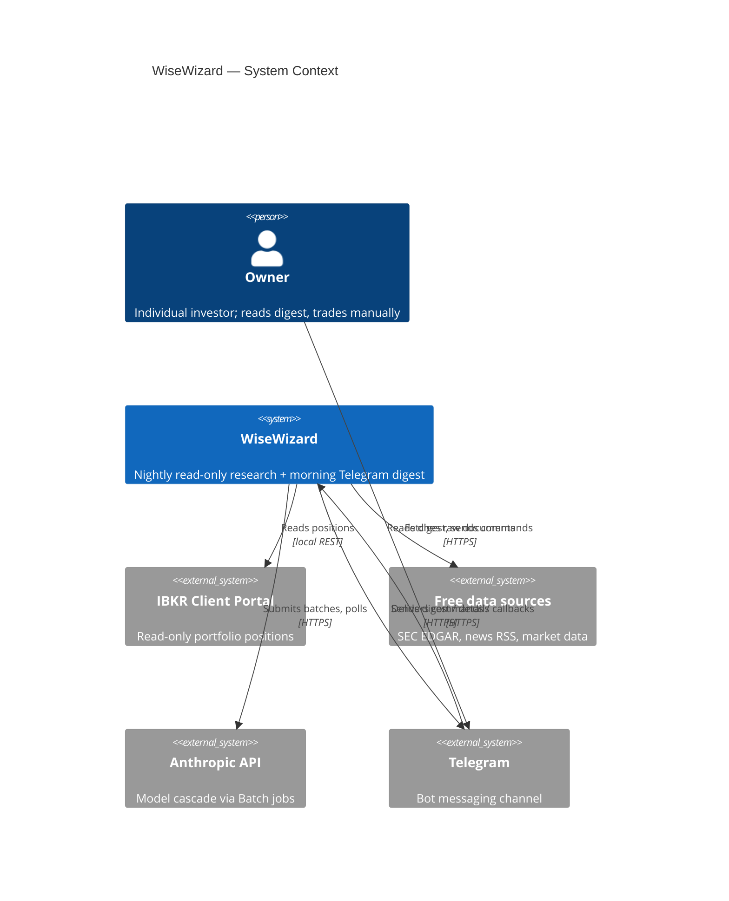
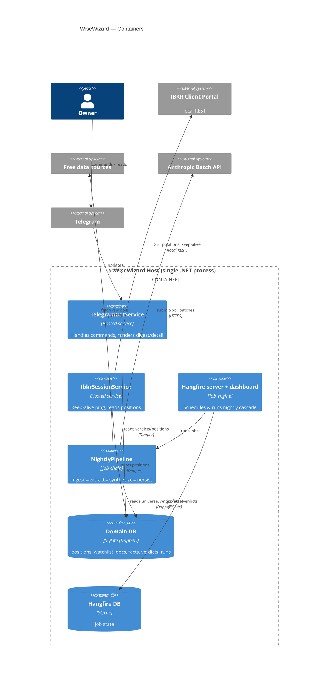
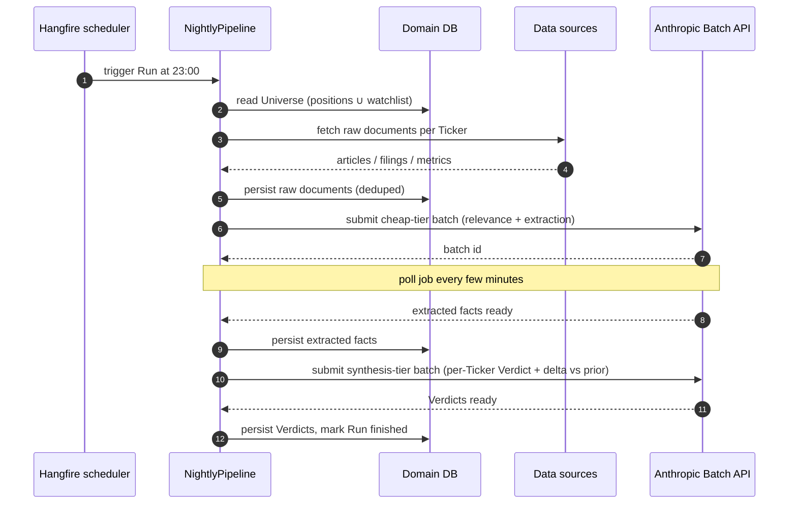
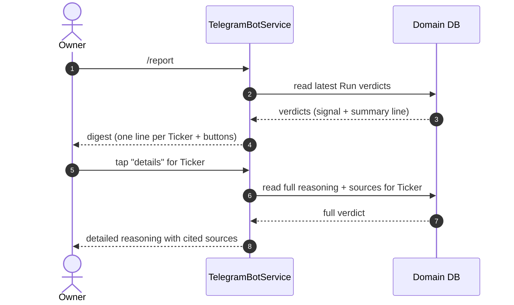

# Software Architecture Document — WiseWizard

<!-- Arc42, 12 sections. C4 Context in §3, C4 Container in §5. -->

## 1. Introduction and goals

**Intent.** WiseWizard is a single-Owner system that maintains a read-only picture of the Owner's Interactive Brokers portfolio and, every night, runs a cheap→smart LLM cascade over the portfolio and a curated watchlist to produce an evidence-based, per-Ticker Verdict (🟢 hold / 🟡 attention / 🔴 review). The Owner reads a 30-second Telegram digest each morning and trades manually. See [idea-brief](./idea-brief.md) §13 and [CONTEXT](./CONTEXT.md).

**Top-3 quality goals (1-liners; full scenarios in §10):**

1. **Cost efficiency** — a full nightly Run over ~40 Tickers stays within a small personal budget by pushing volume to the cheap tier and using asynchronous Batch jobs.
2. **Resilience / recoverability** — a Run survives process restarts, Source outages, and Broker session loss without losing completed work or corrupting state.
3. **Trustworthiness** — every Verdict is backed by cited Sources and a "what changed since yesterday" delta, so the Owner can audit any conclusion.

**Stakeholders.**

| Role | Interest | Sign-off owner? |
|---|---|---|
| Owner | Uses the digest, trades manually, runs the server | Yes |
| Broker (IBKR) | External account holder, read-only access | No |
| Model provider (Anthropic) | LLM cascade + Batch API | No |

## 2. Constraints

**Technical.**
- .NET 9 / C# (Owner's primary language).
- .NET Generic Host with `BackgroundService` hosted services; single OS process.
- Hangfire for job scheduling, persistence, retries, and dashboard.
- SQLite for domain data (Dapper) and a separate SQLite file for Hangfire storage.
- Anthropic API for the model cascade (cheap tier + synthesis tier) via the Message Batches API.
- IBKR **Client Portal API** (local REST gateway) for read-only portfolio access.
- `Telegram.Bot` for the bot interface.

**Organisational.**
- Effort budget: MVP across five features, part-time.
- Deadline: none hard; incremental delivery.
- Team: one developer (the Owner).

**Conventions.**
- Clean dependency direction: `Host → Bot/Pipeline → Infrastructure → Core`. Core has zero external dependencies.
- Every external Source and the Broker/LLM are behind Core-defined interfaces (SOLID / DIP).
- Async I/O throughout (`async`/`await`).
- Structured logging via `Microsoft.Extensions.Logging`.
- SOLID + KISS + high unit-test coverage of pipeline logic without network calls.

**Regulatory / external.**
- No order execution — read-only broker access removes trading-regulatory surface.
- Personal financial data stays on the Owner's own server; no third-party data sharing.
- Respect Source terms: SEC EDGAR fair-access (declared User-Agent, rate limits); RSS polite polling.

## 3. Context and scope

WiseWizard sits between the Owner (via Telegram) and three classes of external system: the Broker (portfolio state), free data Sources (SEC EDGAR, news RSS, market/fundamental data), and the model provider (LLM cascade). It initiates all research itself on a schedule; the Owner never asks ad-hoc questions.

**External systems (in / out):**

| Actor or system | Type | Interaction |
|---|---|---|
| Owner | Person | Reads digest, drills into detail, manages watchlist, taps daily 2FA re-auth |
| Broker — IBKR Client Portal gateway | System (external, local) | Provides Positions read-only over local REST; keep-alive pinged |
| SEC EDGAR | System (external) | Provides filings (free, official API) |
| News RSS feeds | System (external) | Provide news articles (free) |
| Market/fundamental data | System (external) | Provides prices + basic fundamentals (free tier) |
| Anthropic API | System (external) | Runs cheap-tier extraction + synthesis-tier Verdicts via Batch jobs |
| Telegram | System (external) | Delivers messages and callback interactions |

**C4 Context (L1):**



## 4. Solution strategy

**Top-4 strategic choices (the seeds for ADRs):**

1. **Single-process Generic Host with hosted services** — one deployable process hosts the Telegram bot, the broker session keeper, and the Hangfire server. Chosen for KISS: one deploy, one log stream, one config, on the Owner's own always-on server. Seeds ADR-0001. (Quality goal: resilience through simplicity.)
2. **Persistent job engine (Hangfire) for the nightly cascade** — ingestion → cheap-tier extraction → synthesis → persist is a chain of persisted, retried jobs. Chosen so a Run survives restarts and Source flakiness, and is observable in a dashboard. Seeds ADR-0004 and ADR-0005. (Quality goal: recoverability.)
3. **Two-tier model cascade over the Batch API** — high-volume relevance/extraction on the cheap tier, low-volume judgment on the synthesis tier, both submitted as asynchronous batches. Chosen for cost efficiency. Seeds ADR-0005. (Quality goal: cost.)
4. **Read-only broker via Client Portal API + manual daily 2FA** — a local REST gateway kept alive by pings, re-authenticated by an Owner tap when the Broker forces logout. Chosen for HTTP simplicity and to keep the System strictly read-only. Seeds ADR-0002 and ADR-0006. (Quality goal: trust + simplicity.)

Every tactical decision downstream should trace to one of these seeds. Contradictions surface in §11.

## 5. Building block view

Layered/clean architecture with a hosted-services composition root. Dependencies flow inward to `Core`, which defines all abstractions (interfaces + domain models) and depends on nothing. `Infrastructure` implements those abstractions per external system; `Pipeline` and `Bot` orchestrate against the abstractions; `Host` wires everything via DI.

**Internal decomposition:**

```
WiseWizard.sln
├── WiseWizard.Core            # zero external deps
│   ├── Models/                #   Position, Ticker, RawDocument, ExtractedFact,
│   │                          #   Verdict, Signal, DailyReport, Run, WatchlistEntry
│   └── Abstractions/          #   IBrokerReader, INewsSource, ISecFilingsSource,
│                              #   IMarketDataSource, ILlmClient, I*Repository
│
├── WiseWizard.Infrastructure  # implementations of abstractions
│   ├── Ibkr/                  #   ClientPortalBrokerReader, session keep-alive
│   ├── Sec/                   #   EdgarFilingsSource
│   ├── News/                  #   RssNewsSource
│   ├── Market/                #   MarketDataSource
│   ├── Llm/                   #   AnthropicLlmClient (Batch submit/poll/retrieve)
│   └── Persistence/           #   Dapper repositories over SQLite
│
├── WiseWizard.Pipeline        # nightly orchestration (Hangfire jobs + continuations)
│   ├── Steps/                 #   IngestStep, RelevanceStep, SynthesisStep, PersistStep
│   └── NightlyPipeline.cs     #   builds the continuation chain
│
├── WiseWizard.Bot             # Telegram (Telegram.Bot)
│   ├── Handlers/              #   /portfolio, /report, /watch, /unwatch, drill-down callback
│   └── Formatting/            #   digest / detail rendering
│
├── WiseWizard.Host            # composition root: DI, Hangfire, config, logging
│   └── Program.cs             #   Generic Host + hosted services + Hangfire server
│
└── tests/
    ├── WiseWizard.Core.Tests
    ├── WiseWizard.Pipeline.Tests        # cascade on mock sources + LLM fixtures
    └── WiseWizard.Infrastructure.Tests  # integration, opt-in (real APIs)
```

Rule: `Pipeline` and `Bot` depend only on `Core` abstractions, never on concrete `Infrastructure` types. This is what gives Open/Closed extensibility (add a Source = new interface impl) and testability (mock every boundary).

**C4 Container (L2):**



## 6. Runtime view

**Critical flow 1: Nightly research Run (happy path)**



**Critical flow 2: Morning digest read + drill-down**



**Critical flow 3: Broker session expiry (failure mode)** — during keep-alive or a positions read, the gateway reports the session is unauthenticated; `IbkrSessionService` stops pinging, notifies the Owner via Telegram to re-authenticate (tap 2FA in the IBKR app), and resumes keep-alive once the session is live again. The last good Positions snapshot remains in the DB so the digest still renders.

## 7. Deployment view

Single .NET process on the Owner's existing always-on home/VPS server, alongside the IBKR Client Portal gateway (a local Java process) on the same host so the REST endpoint stays on `localhost`. Two SQLite files on local disk (domain + Hangfire). No container orchestration required; optionally packaged as a systemd/Windows service. The Hangfire dashboard is bound to `localhost` only.

> **Datastore update (ADR-0007).** As of the helios deployment the datastore is a single **PostgreSQL** database — domain tables plus Hangfire (isolated under a `hangfire` schema) — rather than two local SQLite files. Dapper is retained; only the driver and dialect change. Local development is orchestrated by **.NET Aspire** (ADR-0008), which provisions the Postgres container and supplies its connection string. The description above records the original SQLite deployment.

**Monitoring:**
- Hangfire dashboard — per-job status, failures, retry history, run history.
- Structured logs to file/console with `run_id` correlation.
- Telegram self-alerts on Run failure and on broker session loss.

**Scaling thresholds:**
- Universe ~40 Tickers × a handful of documents each = a few hundred documents/night → trivial for SQLite.
- Batch jobs bounded by Universe size; well within a personal spend budget.
- If the Universe or history grows past SQLite comfort (e.g. >1M document rows), revisit Postgres — not expected in MVP.

## 8. Crosscutting concepts

| Concept | Convention | Where defined |
|---|---|---|
| Logging | Structured `ILogger`, `run_id` scope on pipeline logs | here / §7 |
| Configuration | `IOptions<T>` from appsettings + user secrets (API keys never in source) | Host |
| Error handling | Each hosted service wraps its loop in try/catch; a failing step fails only its Run, not the process | here |
| Dependency direction | `Host → Bot/Pipeline → Infrastructure → Core`; Core depends on nothing | §5 |
| Source abstraction | Every Source/Broker/LLM behind a Core interface; add a Source = new impl (Open/Closed) | Core/Abstractions |
| Persistence | Dapper repositories. Originally two separate SQLite files (domain + Hangfire); as of **ADR-0007** a single **PostgreSQL** database holds the domain tables and Hangfire (under a `hangfire` schema). Dapper is retained. | Infrastructure/Persistence, ADR-0003 → ADR-0007 |
| Job orchestration | Hangfire recurring job + continuations; batch state persisted for resumability | Pipeline, ADR-0004 |
| Idempotency / dedup | Raw documents deduped by content hash within a Run | data-ingestion feature |
| Secrets | Anthropic key, Telegram token, IBKR creds via user-secrets / env, never committed | Host |
| Time | Nightly trigger at 23:00 local; Batch SLA up to 24h, digest read next morning | §6 |
| Test coverage | **Line + branch coverage MUST be > 95%** across the solution (excluding the `Host` composition root and generated code); enforced in CI via Coverlet threshold | here / §10 QG-4 |

## 9. Architecture decisions

| # | Title | Status | Section |
|---|---|---|---|
| 0001 | Single-process .NET Generic Host with hosted services | Accepted | §4 |
| 0002 | Read-only broker access via IBKR Client Portal API | Accepted | §4 |
| 0003 | SQLite for domain data, separate SQLite for Hangfire | Superseded by 0007 | §8 |
| 0004 | Hangfire for job scheduling, persistence, retries | Accepted | §4 |
| 0005 | Two-tier model cascade over the Anthropic Batch API | Accepted | §4 |
| 0006 | Manual daily 2FA re-auth with keep-alive session | Accepted | §4 |
| 0007 | PostgreSQL for domain data + Hangfire (single DB, `hangfire` schema) | Accepted | §7, §8 |
| 0008 | .NET Aspire for local-dev orchestration | Accepted | §7 |

ADR files live under `docs/00-overview/adr/NNNN-<title>.md`.

## 10. Quality requirements

**QG-1. Cost efficiency**
- **When:** a nightly Run processes the full Universe (~40 Tickers, a few hundred documents).
- **Then:** the bulk of token volume goes to the cheap tier; only distilled facts reach the synthesis tier; all LLM work uses Batch jobs (~50% cheaper).
- **How verify:** per-Run token/cost logged and summed; alert if a Run exceeds a configured cost ceiling.

**QG-2. Resilience / recoverability**
- **When:** the process restarts mid-Run, a Source times out, or a Batch job is still pending at wake-up.
- **Then:** completed steps are not repeated, in-flight batch ids are recovered from storage, failed Source fetches retry with backoff, and the Run either resumes or fails cleanly with an alert.
- **How verify:** kill-and-restart test mid-Run; fault-injection test on a Source; verify Hangfire retry history and resumed batch polling.

**QG-3. Trustworthiness**
- **When:** the Owner drills into any Verdict.
- **Then:** the full reasoning lists the specific Sources it used and states what changed since the previous Run.
- **How verify:** schema validation that every Verdict has ≥1 cited source; snapshot test of delta computation against a seeded prior Run.

**QG-4. Test coverage**
- **When:** the test suite runs in CI on any change.
- **Then:** combined line and branch coverage is strictly greater than 95% across all projects except `WiseWizard.Host` (composition root) and generated code.
- **How verify:** Coverlet collects coverage per test run; the CI gate fails the build if coverage ≤ 95%.

## 11. Risks and technical debt

| Risk / debt | Severity | Mitigation | Owner |
|---|---|---|---|
| Free-source noise leads to low-quality or misleading Verdicts | High | Mandatory relevance filtering, evidence citation, advisory-only framing, "what changed" deltas | Owner |
| Broker session silently expires → stale portfolio | Medium | Keep-alive ping, Telegram alert on session loss, show last-good snapshot with timestamp | Owner |
| `Hangfire.Storage.SQLite` is community-maintained, weaker under load | Low | Load is tiny (dozens of jobs/day); revisit Postgres if it ever strains | Owner |
| Unofficial market data source may break without notice | Medium | Source behind an interface; swap impl or free-tier API if it breaks | Owner |
| Batch job may not finish within expected window | Low | Poll with a generous timeout; digest tolerates a late/failed Run by showing prior Run | Owner |
| Over-trust of 🟢/🔴 by the Owner | Medium | Explicit advisory framing; deltas and citations force auditing | Owner |

**Accepted debt (acceptable in v1, plan to fix later):**
- No memory beyond the previous Run's Verdict (only one-step delta, not full thesis history) — fine for MVP.
- Single hardcoded Owner, no auth on the bot beyond a chat-id allowlist — fine for single-user.
- No market-wide screening — watchlist-only universe.

## 12. Glossary

Defined canonically in [CONTEXT.md](./CONTEXT.md) §Glossary. Key terms: Owner, Position, Portfolio, Ticker, Broker, Brokerage session, Watchlist, Universe, Run, Raw document, Source, Extracted fact, Verdict, Signal, Daily digest, Model cascade, Batch job.
