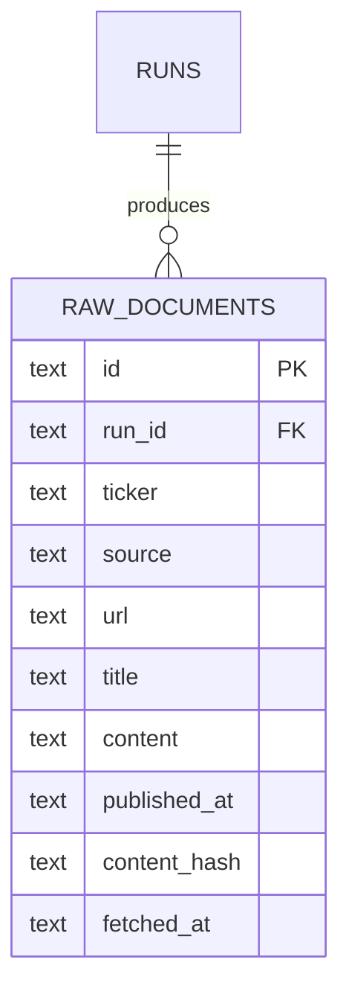

# Data model — data-ingestion

*Datastore note: as of ADR-0007 the store is PostgreSQL (Dapper unchanged). Money columns are `numeric`, identity keys are `BIGINT GENERATED ALWAYS AS IDENTITY`, timestamps remain ISO-8601 text. Column names/semantics below are otherwise unchanged.*

<!-- Stage 08. This feature owns the `raw_documents` table. `runs` is owned by
nightly-research-pipeline (shown here only as the FK parent for context). -->

## ER diagram

## Entities

### `raw_documents`

A single unprocessed item collected from a Source during ingestion, keyed to a Ticker and to the Run that collected it (CONTEXT §Glossary — "Raw document"). Owned by this feature.

| Column | Type | Constraints | Notes |
|---|---|---|---|
| `id` | TEXT | PK, generated app-side (UUID v7, lowercase hex) | Surrogate id; app-generated because SQLite has no native UUID. |
| `run_id` | TEXT | NOT NULL, FK → `runs(id)` | The Run that collected this document; the handoff key to nightly-research-pipeline. |
| `ticker` | TEXT | NOT NULL | The Ticker this document is about; must be a Ticker in the Run's Universe (enforced in code, not DB). |
| `source` | TEXT | NOT NULL | Origin Source: one of `sec_edgar`, `news_rss`, `market_data` (the three fixed free Sources; CONTEXT §Glossary). |
| `url` | TEXT | NOT NULL | Canonical link back to the document at its Source, so a Verdict can cite it. |
| `title` | TEXT | NULL | Human-readable title/headline; NULL for a market-data snapshot that has no title. |
| `content` | TEXT | NOT NULL | The raw fetched body/payload as opaque text (article text, filing text, or serialized metrics snapshot). |
| `published_at` | TEXT | NOT NULL | ISO-8601 UTC publish/effective time from the Source; used for the lookback-window filter. |
| `content_hash` | TEXT | NOT NULL | Hash of normalized content used for dedup within a Run (sad.md §8). |
| `fetched_at` | TEXT | NOT NULL | ISO-8601 UTC time the System fetched the document. |

<!-- Timestamps are TEXT ISO-8601 UTC per SQLite/Dapper convention (ADR-0003); SQLite has no dedicated timestamp type. Business rules (lookback window, per-Source caps, Universe membership) live in code, not in DB constraints. -->

**Access patterns:**
- Dedup check while ingesting a Ticker in a Run: lookup by (`run_id`, `content_hash`) → unique index `ux_raw_documents_run_hash`.
- Pipeline reads all documents for a Run to extract facts: filter by `run_id` (optionally `ticker`) → index `ix_raw_documents_run_ticker`.
- Retention cleanup removes old rows: range scan on `fetched_at` → index `ix_raw_documents_fetched_at`.

**Constraints:**
- UNIQUE on (`run_id`, `content_hash`) — enforces the domain invariant "no duplicate Raw document within a Run" (PRD §5 AC-04; sad.md §8). Dedup is scoped to the Run: the same article legitimately reappears in a later Run.
- FK (`run_id`) → `runs(id)` — every Raw document belongs to exactly one Run.

## Indexes

| Index | Columns | Query it serves |
|---|---|---|
| `ux_raw_documents_run_hash` | (`run_id`, `content_hash`) UNIQUE | Dedup within a Run; blocks a second row with identical content in the same Run. |
| `ix_raw_documents_run_ticker` | (`run_id`, `ticker`) | Pipeline reads collected documents for a Run / Ticker to extract facts. |
| `ix_raw_documents_fetched_at` | (`fetched_at`) | Retention cleanup deletes documents older than the 90-day window. |

## Retention / cleanup

- Raw documents are kept **90 days** (PRD §6), then removed by a scheduled cleanup so the store does not grow without bound (PRD §5 AC-08).
- Cleanup deletes `raw_documents` where `fetched_at` is older than the retention window; it runs as a lightweight recurring Hangfire job (ADR-0004), separate from the nightly ingest step.
- Retention is by `fetched_at` (when collected) rather than `published_at` so that a recently collected but old-dated filing is still retained for its full audit window.

## Handoff

This feature produces `raw_documents` rows keyed to `run_id`. The nightly-research-pipeline feature consumes them read-only (extraction reads by `run_id`) and owns the `runs` table and the overall Hangfire continuation chain. The interface boundary is: ingestion writes `raw_documents`, pipeline reads them — no shared mutable state beyond this table.
