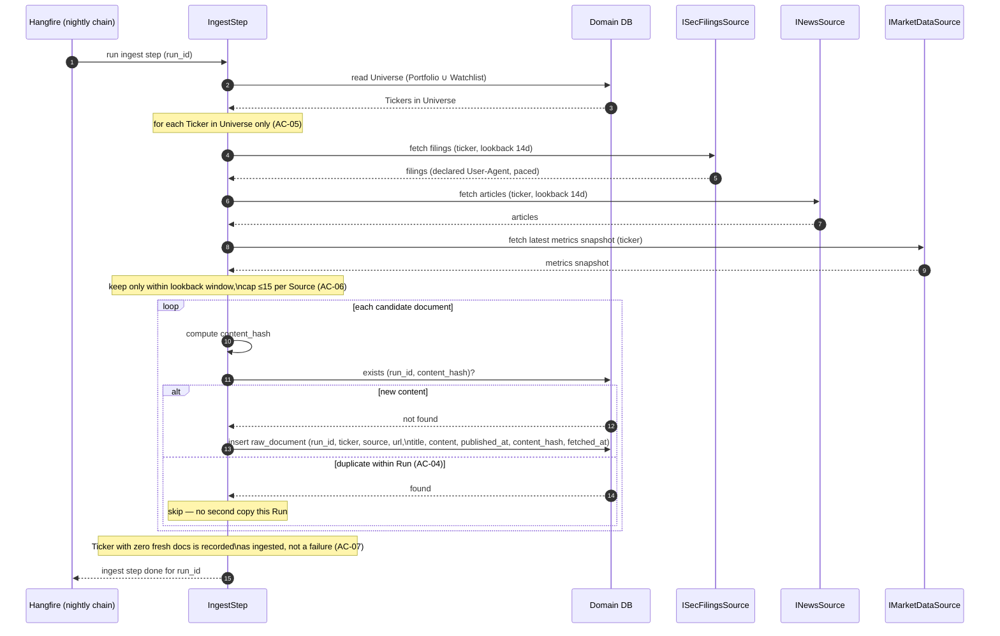

# Sequence — ingest one Ticker (happy path + dedup)

<!-- Stage 07. Covers the happy collection path for a single Ticker plus the
dedup and Universe-scoping invariants. Realizes PRD §5 AC-01, AC-04, AC-05,
AC-06, AC-07. See sad.md §5 (Source interfaces) and §8 (dedup by content hash). -->

## Happy path

## Invariant note

- **Universe scoping (AC-05):** `IngestStep` iterates only the Tickers returned by the Universe read; a Ticker outside Portfolio ∪ Watchlist is never fetched.
- **Dedup (AC-04):** the `(run_id, content_hash)` uniqueness check happens before insert; the DB unique index `ux_raw_documents_run_hash` is the backstop if two candidates race.
- **Bounds (AC-06):** lookback filter and per-Source cap are applied in code before the dedup loop.
