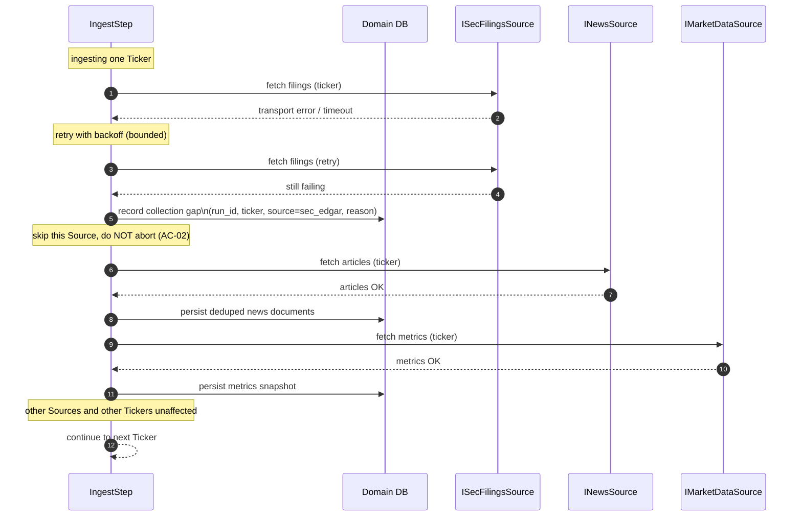
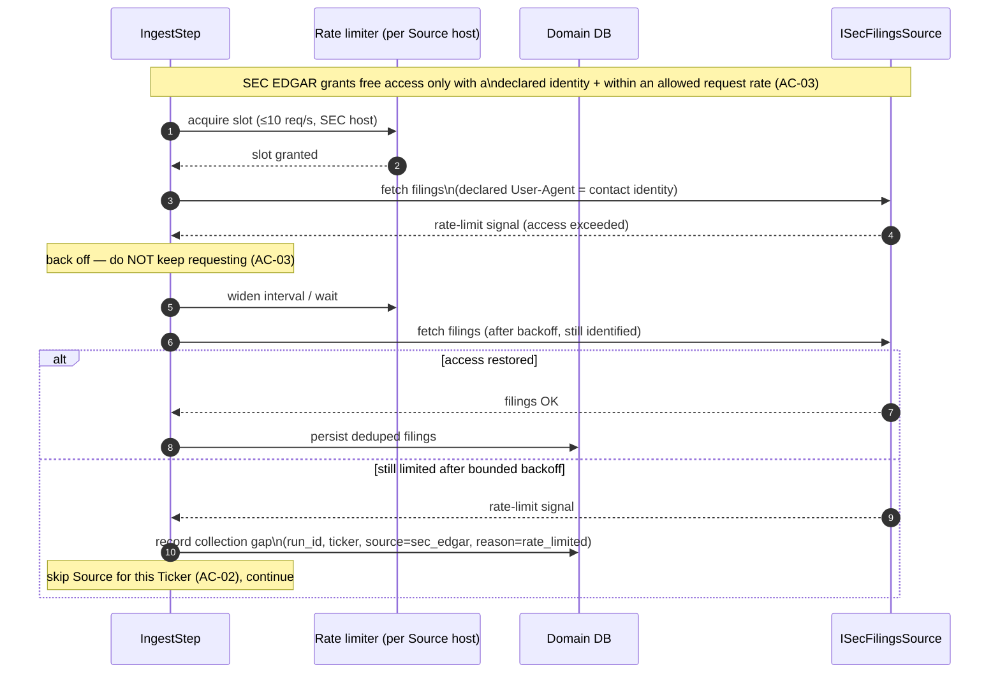

# Sequence — Source failure and rate-limit handling

<!-- Stage 07. Covers the error and authorization paths: a Source is unreachable
or signals its allowed access rate is exceeded. Realizes PRD §5 AC-02 (error)
and AC-03 (authorization / polite access). See sad.md §1 QG-2, §8. -->

## Error path: a Source is unreachable

## Authorization / rate-limit path: Source signals allowed access exceeded

## Notes

- **Isolation (AC-02):** a failed or rate-limited Source produces a recorded gap for that (Run, Ticker, Source) and never fails the Run or blocks other Sources/Tickers; the Hangfire ingest step still completes so the pipeline chain continues (ADR-0004, sad.md §1 QG-2).
- **Polite access (AC-03):** every request to a Source that requires it carries the System's declared identity (User-Agent for SEC EDGAR), and the per-host rate limiter keeps requests within the Source's allowed access rate, backing off on rate-limit signals rather than hammering.
