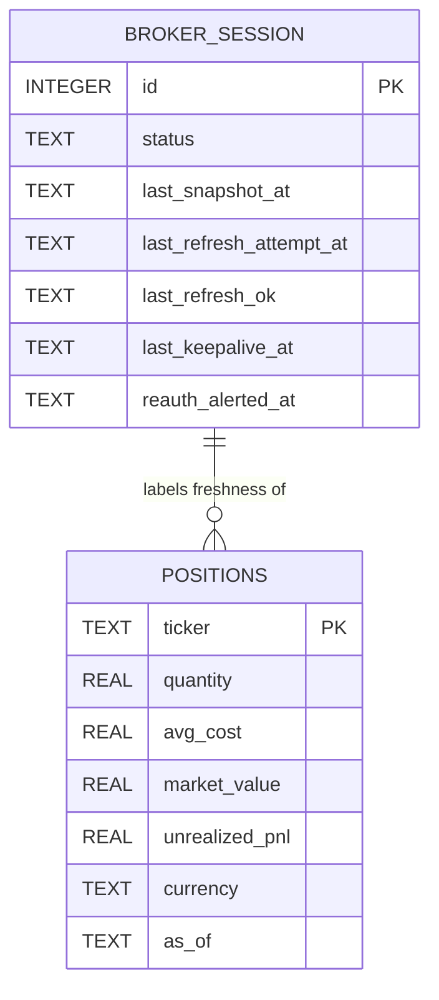

# Data model — ibkr-portfolio-read

*Datastore note: as of ADR-0007 the store is PostgreSQL (Dapper unchanged). Money columns are `numeric`, identity keys are `BIGINT GENERATED ALWAYS AS IDENTITY`, timestamps remain ISO-8601 text. Column names/semantics below are otherwise unchanged.*

<!-- Stage 08. SQLite (Dapper) domain DB per sad.md §5 / ADR-0003. This feature
owns the `positions` snapshot table and the `broker_session` state table.
Upstream: PRD §AC-01, §AC-02, §AC-06, §AC-07 · sad.md §5, §6 (flow 3) · ADR-0002, ADR-0006. -->

## Overview

This feature owns two tables in the domain SQLite DB:

- **`positions`** — a **snapshot** of the Owner's current Portfolio. It is **fully overwritten before each successful refresh** (delete-all-then-insert inside one transaction): the table always holds exactly the newest known-good set of Positions, never history. A refresh that fails leaves the previous snapshot untouched (PRD §AC-03, §AC-06). An empty-but-current Portfolio is a table with zero `positions` rows plus a fresh `broker_session.last_snapshot_at` (PRD §AC-07).
- **`broker_session`** — a single-row table tracking Brokerage session state and the age of the last known-good snapshot, so the Owner can be shown Portfolio age and re-auth state (PRD §AC-03, §AC-04; sad.md §6 flow 3).

SQLite has no native `DECIMAL`/`UUID`/`TIMESTAMPTZ`; money is stored as `REAL`, timestamps as ISO-8601 `TEXT` in UTC, per ADR-0003 conventions.

## ER diagram

## Entities

### `positions`

Snapshot of the current Portfolio. One row per Ticker held. Overwritten wholesale on each successful refresh.

| Column | Type | Constraints | Notes |
|---|---|---|---|
| `ticker` | TEXT | PK, NOT NULL | The Ticker symbol, canonical key (e.g. `AAPL`). Uppercased. One row per held Ticker → PK enforces the "no duplicate holdings" part of PRD §AC-06. |
| `quantity` | REAL | NOT NULL | Units held (may be fractional). |
| `avg_cost` | REAL | NOT NULL | Average cost per unit, from the Broker. |
| `market_value` | REAL | NOT NULL | Current market value of the Position, from the Broker. |
| `unrealized_pnl` | REAL | NOT NULL | Unrealized profit-or-loss, from the Broker. |
| `currency` | TEXT | NOT NULL DEFAULT 'USD' | Currency of the money figures; carried through for correctness. |
| `as_of` | TEXT | NOT NULL | ISO-8601 UTC instant the snapshot was read. Same value for every row of one snapshot (PRD §AC-01). |

**Access patterns:**
- Read the whole current Portfolio for a Run / digest → full-table scan (≤~20 rows; trivial, no index needed beyond PK).
- Read one Ticker's Position for drill-down → PK lookup on `ticker`.

**Constraints:** PK on `ticker` (no two rows for the same Ticker in one snapshot — PRD §AC-06). No FK — the snapshot is standalone; Watchlist/Universe join happens in code (PRD §AC-08).

**Write pattern:** on a successful refresh, in one transaction: `DELETE FROM positions;` then insert the new rows with a single shared `as_of`. On a failed refresh: no write to `positions` (last known-good retained — PRD §AC-03). Empty Portfolio: `DELETE` leaves zero rows, `broker_session.last_snapshot_at` still advances (PRD §AC-07).

### `broker_session`

Single-row (`id = 1`) table holding Brokerage session state and snapshot freshness. Read to render Portfolio age and re-auth state; written by `IbkrSessionService` on keep-alive, refresh, and lapse (sad.md §6 flow 3, ADR-0006).

| Column | Type | Constraints | Notes |
|---|---|---|---|
| `id` | INTEGER | PK, CHECK (`id` = 1) | Singleton row — exactly one Brokerage session for the single Owner. |
| `status` | TEXT | NOT NULL | Session state: `live`, `lapsed`, or `unknown`. Drives keep-alive and re-auth alerting (PRD §AC-04). |
| `last_snapshot_at` | TEXT | NULL | ISO-8601 UTC of the last **successful** Portfolio refresh (= `positions.as_of`). Portfolio age = now − this. NULL until first success. Basis for staleness threshold (PRD §6). |
| `last_refresh_attempt_at` | TEXT | NULL | ISO-8601 UTC of the last refresh attempt (success or failure). |
| `last_refresh_ok` | TEXT | NULL | `'true'` / `'false'` — whether the last attempt persisted a snapshot (PRD §AC-03). |
| `last_keepalive_at` | TEXT | NULL | ISO-8601 UTC of the last successful keep-alive ping (PRD §AC-09). |
| `reauth_alerted_at` | TEXT | NULL | ISO-8601 UTC the Owner was last alerted to re-authenticate; cleared on recovery. Guards single-alert-per-lapse (PRD §8 open question). |

**Access patterns:**
- Read session state on each keep-alive tick and before each refresh → PK lookup on `id = 1`.
- Read `last_snapshot_at` / `status` when rendering the digest → PK lookup.

**Constraints:** singleton via `CHECK (id = 1)` — exactly one Owner, one Brokerage session (CONTEXT invariant). No FK.

## Indexes

| Index | Columns | Query it serves |
|---|---|---|
| (PK) `positions` | `ticker` | Per-Ticker drill-down lookup; uniqueness of holdings. |
| (PK) `broker_session` | `id` | Singleton session-state read/write. |

No secondary indexes: both tables are tiny (≤~20 Positions; one session row), so scans are effectively free and extra indexes would only add write cost.
