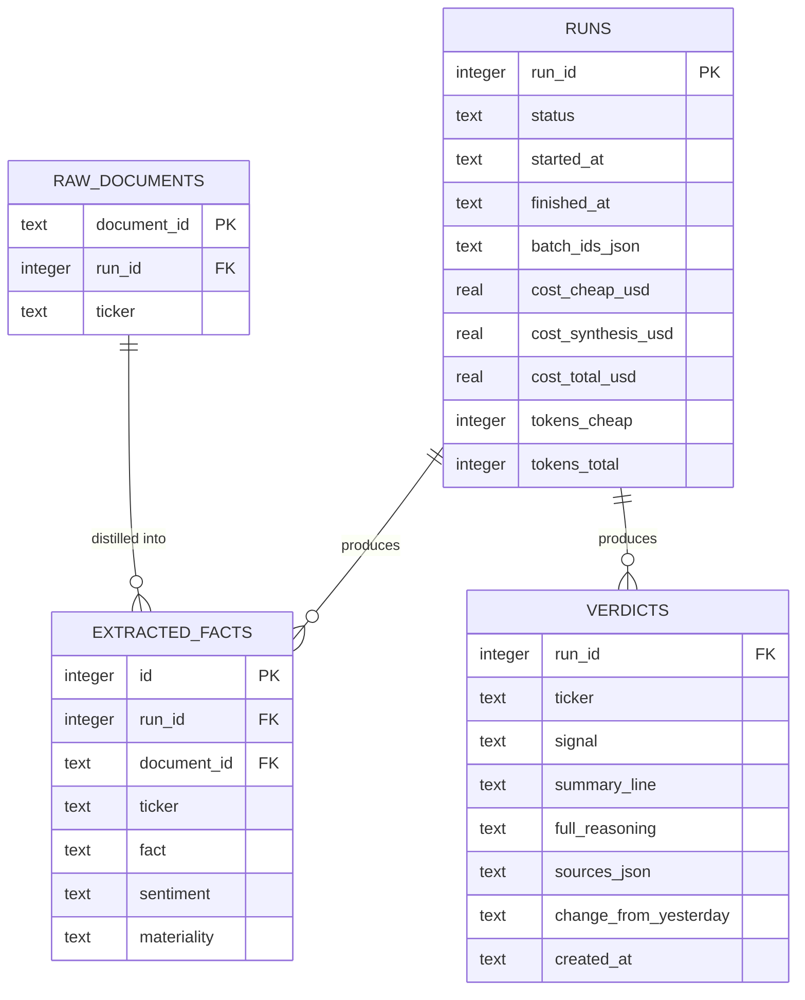

# Data model — nightly-research-pipeline

*Datastore note: as of ADR-0007 the store is PostgreSQL (Dapper unchanged). Money columns are `numeric`, identity keys are `BIGINT GENERATED ALWAYS AS IDENTITY`, timestamps remain ISO-8601 text. Column names/semantics below are otherwise unchanged.*

> **Owns:** `runs`, `extracted_facts`, `verdicts` (in the domain SQLite file, per [ADR-0003](../../00-overview/adr/0003-sqlite-persistence.md)).
> **References (owned elsewhere, do NOT redefine here):** `positions` (ibkr-portfolio-read), `watchlist` (watchlist-management), `raw_documents` (data-ingestion). The Universe = distinct Tickers in `positions` ∪ `watchlist`; Raw documents are read from `raw_documents` keyed by `run_id`.
> Persistence is Dapper over SQLite in WAL mode (sad.md §8). Hangfire's own job/continuation state lives in a **separate** SQLite file and is not modelled here; Batch ids and Run state needed for resumability are stored in `runs` (ADR-0004).

## ER diagram

`RAW_DOCUMENTS` is shown for context only — it is owned by data-ingestion.

## Entities

### `runs`

One row per nightly Run. Holds the durable Run state and in-flight Batch ids that make a Run resumable after a restart (ADR-0004), plus per-tier cost/token accounting for the cost ceiling (PRD §6, sad.md §10 QG-1).

| Column | Type | Constraints | Notes |
|---|---|---|---|
| `run_id` | INTEGER | PK, autoincrement | Canonical Run identifier used across all pipeline tables and logs (`run_id` log scope). |
| `status` | TEXT | NOT NULL | Run lifecycle: `pending`, `ingesting`, `extracting`, `synthesizing`, `persisting`, `finished`, `failed`. Only `finished` counts as a completed Run. |
| `started_at` | TEXT | NOT NULL | ISO-8601 UTC timestamp when the Run began. |
| `finished_at` | TEXT | NULL until terminal | ISO-8601 UTC timestamp when the Run reached `finished` or `failed`. |
| `batch_ids_json` | TEXT | NOT NULL DEFAULT '{}' | Persisted map of tier → in-flight/completed Batch job id (`{"cheap":"...","synthesis":"..."}`). Read on restart to resume polling (AC-08). |
| `cost_cheap_usd` | REAL | NOT NULL DEFAULT 0 | Accumulated cheap-tier cost. |
| `cost_synthesis_usd` | REAL | NOT NULL DEFAULT 0 | Accumulated synthesis-tier cost. |
| `cost_total_usd` | REAL | NOT NULL DEFAULT 0 | Sum of tier costs; compared to the configured ceiling (AC-07). |
| `tokens_cheap` | INTEGER | NOT NULL DEFAULT 0 | Cheap-tier token volume, for the ≥80% cheap-share NFR. |
| `tokens_total` | INTEGER | NOT NULL DEFAULT 0 | Total token volume across tiers. |
| `failure_reason` | TEXT | NULL | Plain-language reason recorded on `failed` (batch failure, timeout, ceiling reached); surfaced in the Owner alert. |

**Access patterns:**
- "latest completed Run" (for the Daily digest and as the delta baseline) → index `idx_runs_status_finished` on `(status, finished_at DESC)`.
- "resume in-flight Run(s) after restart" → filter `status NOT IN ('finished','failed')`, served by `idx_runs_status_finished`.

**Constraints:** `status` restricted to the enumerated set in application code (not a DB CHECK, per the KISS convention — business logic lives in code).

### `extracted_facts`

Structured statements distilled by the cheap-tier model from a single Raw document about a Ticker (CONTEXT: Extracted fact). Many rows per Run; the high-volume tier output.

| Column | Type | Constraints | Notes |
|---|---|---|---|
| `id` | INTEGER | PK, autoincrement | Row id. |
| `run_id` | INTEGER | NOT NULL, FK → `runs(run_id)` | The Run that produced this fact. |
| `document_id` | TEXT | NOT NULL, FK → `raw_documents(document_id)` | The Raw document this fact was distilled from; the citation link for a Verdict's evidence. |
| `ticker` | TEXT | NOT NULL | The Ticker the fact concerns (CONTEXT: canonical grouping key). |
| `fact` | TEXT | NOT NULL | The distilled statement of what was said. |
| `sentiment` | TEXT | NOT NULL | Cheap-tier classification, e.g. `positive` / `neutral` / `negative`. |
| `materiality` | TEXT | NOT NULL | Cheap-tier materiality band, e.g. `low` / `medium` / `high`. |

**Access patterns:**
- "all facts for a Ticker in a Run" (input to the synthesis tier and to Verdict citations) → index `idx_facts_run_ticker` on `(run_id, ticker)`.

**Constraints:** FK `run_id` → `runs(run_id)`; FK `document_id` → `raw_documents(document_id)`. A synthesis conclusion with no backing `extracted_facts` (and therefore no citable `document_id`) must not become a Verdict (AC-05) — enforced in application code.

### `verdicts`

The per-Ticker, per-Run conclusion produced by the synthesis tier (CONTEXT: Verdict). One row per (Ticker, Run). Consumed by telegram-bot-reporting for the Daily digest and drill-down.

| Column | Type | Constraints | Notes |
|---|---|---|---|
| `run_id` | INTEGER | NOT NULL, FK → `runs(run_id)` | The Run this Verdict belongs to. |
| `ticker` | TEXT | NOT NULL | The Ticker this Verdict concerns. |
| `signal` | TEXT | NOT NULL | Traffic-light Signal: `hold` (🟢) / `attention` (🟡) / `review` (🔴). |
| `summary_line` | TEXT | NOT NULL | One-line Owner-facing summary shown in the digest. |
| `full_reasoning` | TEXT | NOT NULL | Full reasoning revealed on drill-down. |
| `sources_json` | TEXT | NOT NULL | JSON array of the cited `document_id`s (the Raw documents that informed the Verdict). Must contain ≥ 1 entry — a Verdict with no evidence is invalid (CONTEXT invariant; AC-05). |
| `change_from_yesterday` | TEXT | NOT NULL | What changed vs the previous completed Run's Verdict for this Ticker, or a `new` marker when none exists (AC-02, AC-06). |
| `created_at` | TEXT | NOT NULL | ISO-8601 UTC timestamp when the Verdict was persisted. |

**Access patterns:**
- "latest Run's Verdicts, one per Ticker" (digest) → join to latest `finished` Run via `idx_runs_status_finished`, then `idx_verdicts_run_ticker`.
- "previous Verdict for a Ticker" (delta baseline) → index `idx_verdicts_ticker_created` on `(ticker, created_at DESC)` to fetch the most recent Verdict for a Ticker before the current Run.

**Constraints:** composite PK `(run_id, ticker)` — exactly one Verdict per Ticker per Run (CONTEXT: a Verdict belongs to exactly one Run and one Ticker). FK `run_id` → `runs(run_id)`. `sources_json` non-empty enforced in application code before insert.

## Indexes

| Index | Columns | Query it serves |
|---|---|---|
| `idx_runs_status_finished` | `runs(status, finished_at DESC)` | Latest completed Run (digest + delta baseline); resumable in-flight Runs. |
| `idx_facts_run_ticker` | `extracted_facts(run_id, ticker)` | All Extracted facts for a Ticker within a Run (synthesis input + citations). |
| `idx_verdicts_run_ticker` | `verdicts(run_id, ticker)` | All Verdicts of a Run / a specific Ticker's Verdict in a Run (digest, drill-down). |
| `idx_verdicts_ticker_created` | `verdicts(ticker, created_at DESC)` | Previous Verdict per Ticker for the "what changed" delta. |

## Handoffs / interfaces

- **Consumes** `raw_documents` (owned by data-ingestion), read by `run_id`, as cheap-tier input and as the evidence pool cited in `verdicts.sources_json` via `extracted_facts.document_id`.
- **Consumes** the Universe = distinct Tickers of `positions` (ibkr-portfolio-read) ∪ `watchlist` (watchlist-management), read at Run start.
- **Produces** `verdicts` and `runs`, consumed by telegram-bot-reporting to render the Daily digest (latest completed Run) and drill-down.
