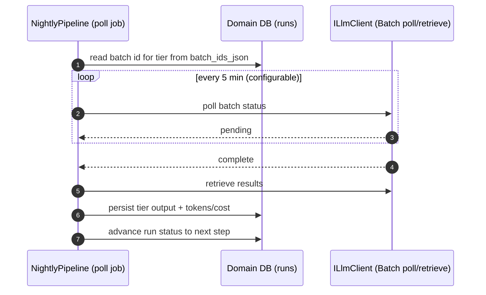

# Sequence — Batch poll + resume after restart

<!-- Realizes PRD §5 AC-08 and sad.md §10 QG-2 (recoverability). ADR-0004 (Hangfire persistence), ADR-0005 (Batch API). -->
<!-- Covers: normal polling + process-restart resume with zero repeated completed steps. -->

## Happy path — polling an in-flight Batch job



## Resume path — process restarts while a synthesis Batch is pending

```mermaid
sequenceDiagram
    autonumber
    participant Boot as Host startup
    participant HF as Hangfire (persisted job state)
    participant P as NightlyPipeline
    participant DB as Domain DB (runs)
    participant LLM as ILlmClient (Batch poll)

    Note over Boot,HF: process was killed mid-Run; extraction already persisted,<br/>synthesis batch id already saved in batch_ids_json
    Boot->>HF: resume from durable job state
    HF->>P: re-enter the pending poll/continuation
    P->>DB: load Run by run_id (status=synthesizing)
    P->>DB: read persisted synthesis batch id
    alt extracted_facts already present for run_id
        Note over P,DB: skip re-running the cheap tier — completed step is not repeated
    end
    P->>LLM: resume polling the same synthesis batch
    loop every 5 min until complete
        P->>LLM: poll batch status
        LLM-->>P: pending
    end
    LLM-->>P: complete
    P->>LLM: retrieve results
    P->>DB: read prior Verdict per Ticker (delta baseline)
    P->>DB: insert Verdicts idempotently by (run_id, ticker)
    Note over P,DB: composite PK (run_id, ticker) prevents duplicate Verdicts on replay
    P->>DB: status=finished, finished_at
```
