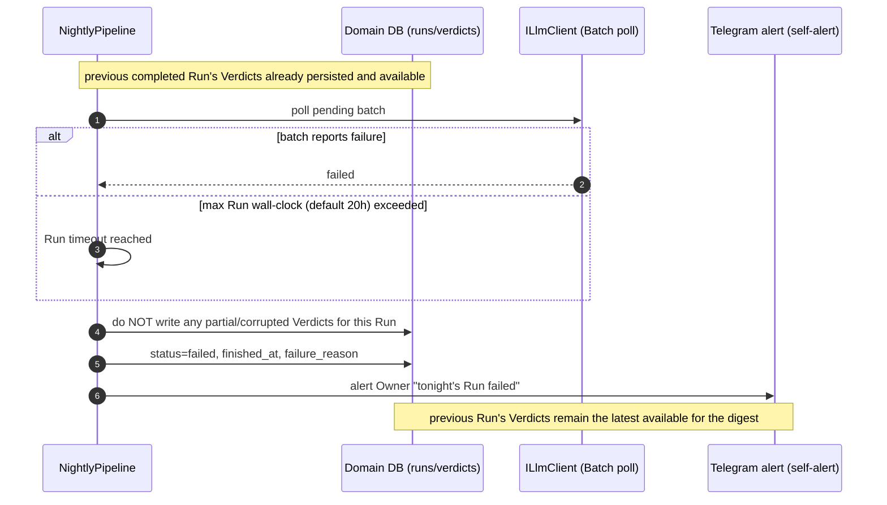
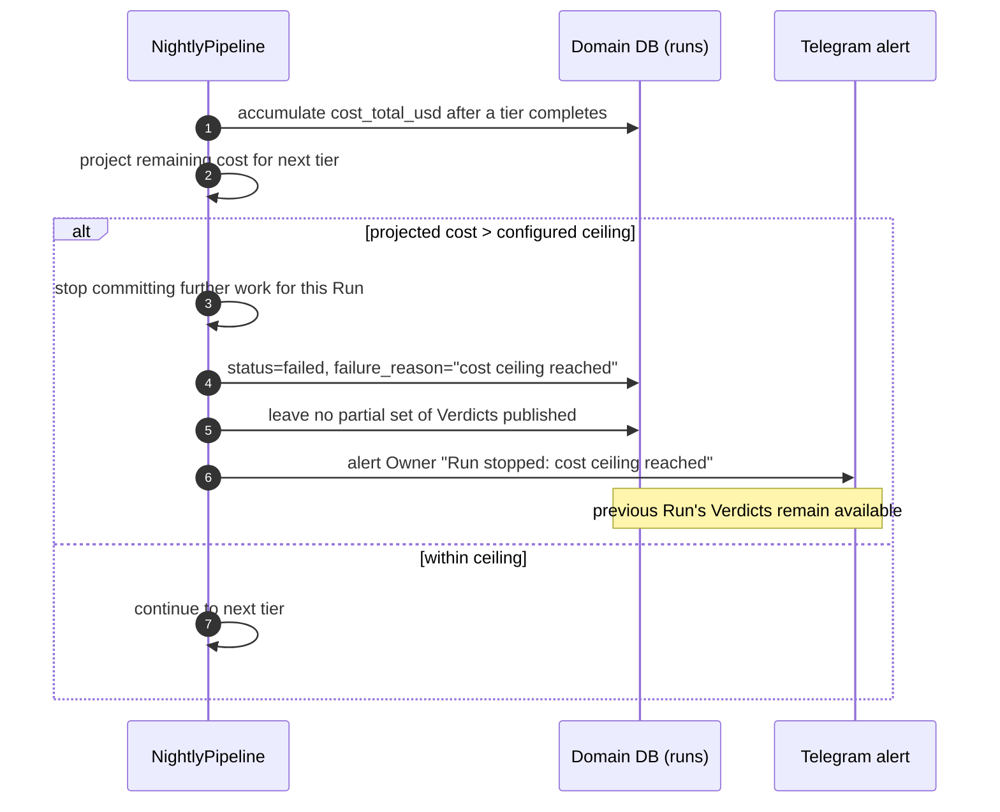

# Sequence — Run failure (clean fail + alert, previous Run preserved)

<!-- Realizes PRD §5 AC-03 (batch failure/timeout) and AC-07 (cost ceiling). sad.md §10 QG-2. -->
<!-- Covers: two failure modes; both fail cleanly, alert the Owner, and keep the previous Run's Verdicts intact. -->

## Error path — Batch job fails or Run exceeds max wall-clock

## Error path — per-Run cost ceiling reached

