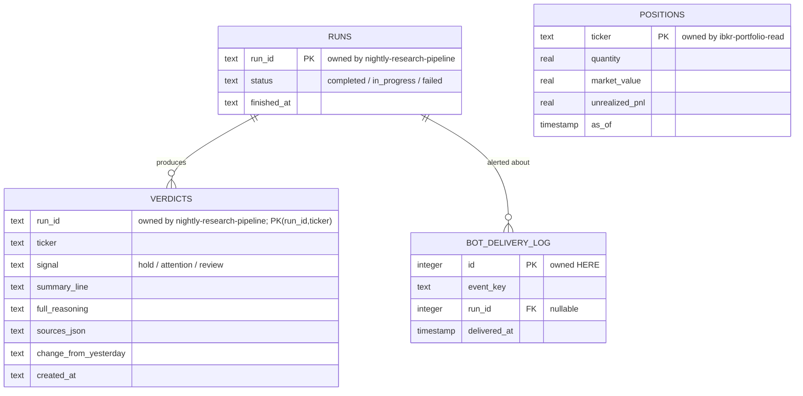

# Data model — telegram-bot-reporting

*Datastore note: as of ADR-0007 the store is PostgreSQL (Dapper unchanged). Money columns are `numeric`, identity keys are `BIGINT GENERATED ALWAYS AS IDENTITY`, timestamps remain ISO-8601 text. Column names/semantics below are otherwise unchanged.*

<!-- Stage 08 → see SDLC/plugin/skills/generate-data-model/SKILL.md -->

## Ownership summary

This feature is the presentation/interaction layer. It **owns no new domain tables** — it READS data produced by other features and renders it to the Owner:

- **`verdicts`** — owned by the **nightly-research-pipeline** feature (Signal, one-line summary, full reasoning, cited Sources, "what changed", `run_id`, `ticker`). Referenced here, not redefined.
- **`runs`** — owned by the **nightly-research-pipeline** feature (run id, start/finish time, status). Used to resolve "the latest completed Run". Referenced, not redefined.
- **`positions`** — owned by the **ibkr-portfolio-read** feature (Ticker, quantity, avg cost, market value, unrealized P&L, `as_of`). Referenced, not redefined.
- **`watchlist`** — owned by the **watchlist-management** feature. The bot only carries `/watch`, `/unwatch`, `/watchlist` commands to that domain's repository; it does not define or migrate the table.

The only persistence this feature *may* own is one tiny operational table, `bot_delivery_log`, to make alert delivery idempotent and observable (so the same Run-failure or session-lapse event is not re-alerted after a process restart — ADR-0001 single process, ADR-0003 SQLite). It holds **no financial values** — only event/message identifiers and timestamps. If the Owner prefers, this can be dropped and idempotency handled purely in memory; it is included because a Run must survive restarts (CONTEXT invariant) and alerts should not double-fire across a restart.

## ER diagram

## Entities

### `bot_delivery_log` (owned by this feature)

Operational idempotency/audit log for outbound alerts (and optionally digests). Never stores holdings, prices, or reasoning text.

| Column | Type | Constraints | Notes |
|---|---|---|---|
| `id` | INTEGER | PK, AUTOINCREMENT | surrogate key |
| `event_key` | TEXT | NOT NULL, UNIQUE | stable de-dup key for an alert-able event, e.g. `run_failed:<run_id>` or `session_lapse:<lapse_started_at>`; the UNIQUE key is what makes re-alerting after a restart a no-op |
| `event_kind` | TEXT | NOT NULL | `run_failed` / `session_lapse` (extensible) |
| `run_id` | INTEGER | NULL | references `runs(id)` when the event is Run-related; NULL for session events. Soft reference only — no cross-feature FK enforced (see below) |
| `delivered_at` | TIMESTAMP | NOT NULL | moment the message was accepted by Telegram |
| `created_at` | TIMESTAMP | NOT NULL DEFAULT (current timestamp) | row insert time |

**Access patterns:**
- "Has this event already been alerted?" → point lookup on `event_key` (served by its UNIQUE index) before sending; insert-on-success makes delivery idempotent across restarts.
- "What did the bot recently alert about?" (debugging) → scan by `delivered_at` (rare, small table).

**Constraints:** UNIQUE on `event_key`. No enforced FK to `runs(id)` — `runs` is owned by another feature/module and SQLite cross-module FKs are avoided per the clean-boundary rule (sad.md §5); `run_id` is a soft reference validated in code, not by the DB.

## Read access patterns this feature relies on (tables owned elsewhere)

These are the queries the bot's Dapper repositories issue. Indexes are **owned and provided by the upstream features**; listed here as the access contract this feature depends on.

| Read pattern (this feature) | Query shape | Index it relies on (owned upstream) |
|---|---|---|
| Resolve the latest completed Run | most recent `runs` row where status = completed, by `finished_at` desc | index on `runs(status, finished_at)` — provided by nightly-research-pipeline |
| Digest: all Verdicts of that Run | all `verdicts` where `run_id` = latest-completed, ordered by Signal then Ticker | index on `verdicts(run_id)` — provided by nightly-research-pipeline |
| Drill-down: one Ticker's Verdict in that Run | single `verdicts` row by (`run_id`, `ticker`) | index on `verdicts(run_id, ticker)` — provided by nightly-research-pipeline |
| Portfolio summary: all current Positions | all `positions` with their `as_of` | primary/clustered access on `positions(ticker)` — provided by ibkr-portfolio-read |
| Watchlist list/add/remove | delegated to the watchlist-management repository | owned by watchlist-management |

If any relied-upon index above is missing when this feature is implemented, that is a defect in the owning feature, not a change this feature makes.

## Indexes

| Index | Columns | Query it serves |
|---|---|---|
| `ux_bot_delivery_event` | `bot_delivery_log(event_key)` | idempotent alert de-dup lookup before send |

<!-- Why: business logic lives in code, not in DB. This feature adds only one small operational table with a single UNIQUE de-dup index; all domain data is read from tables owned by other features. -->
