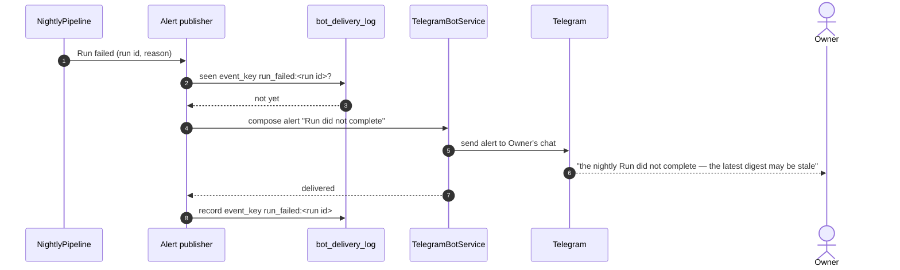
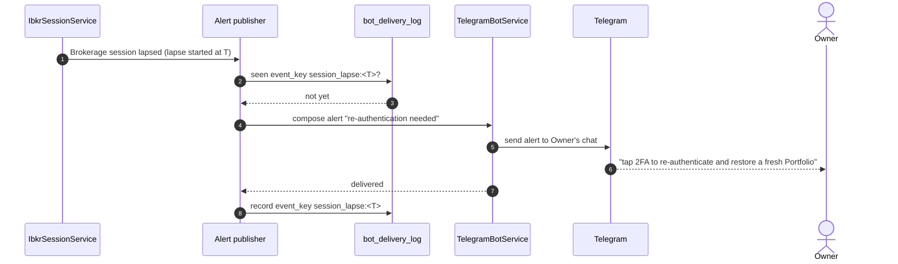
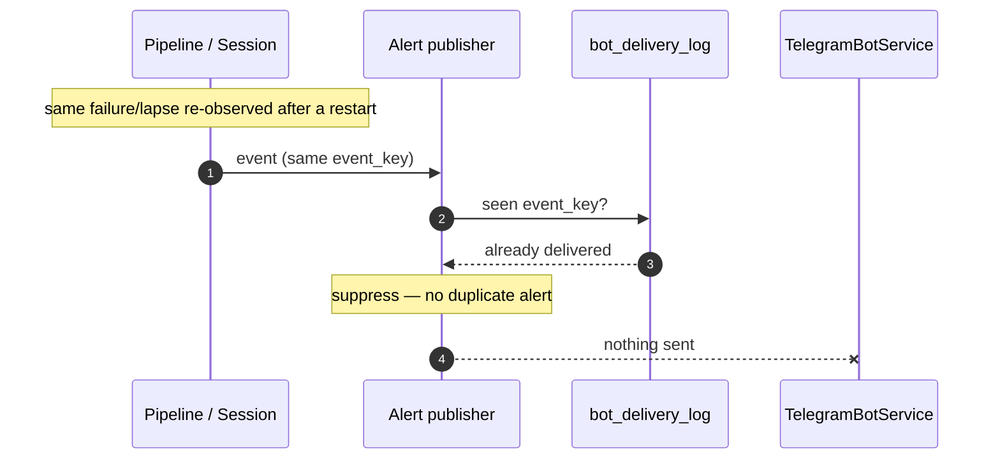

# Sequence — Self-alerts (Run failure & session re-auth)

<!-- Stage 07. Covers Run-failure alert, session-lapse alert, and idempotent no-duplicate-alert on restart. -->
<!-- Realizes sad.md §6 flow 3 (session alert) + monitoring self-alerts (sad.md §7). PRD AC-07, AC-08. -->

## Run-failure alert (happy path)

## Session re-auth alert (happy path)

## Idempotency — process restarts after an alert already fired

