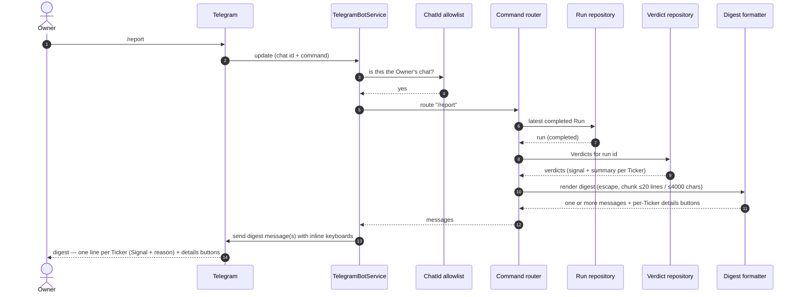
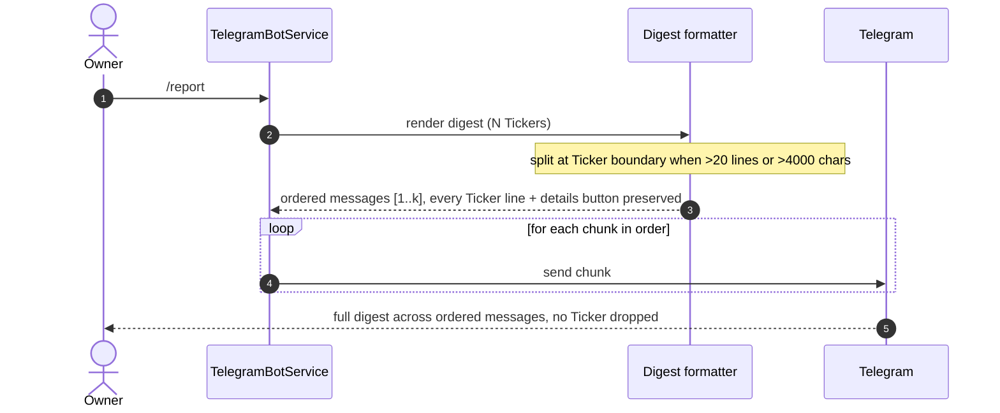
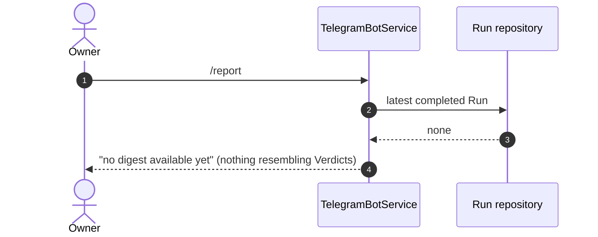
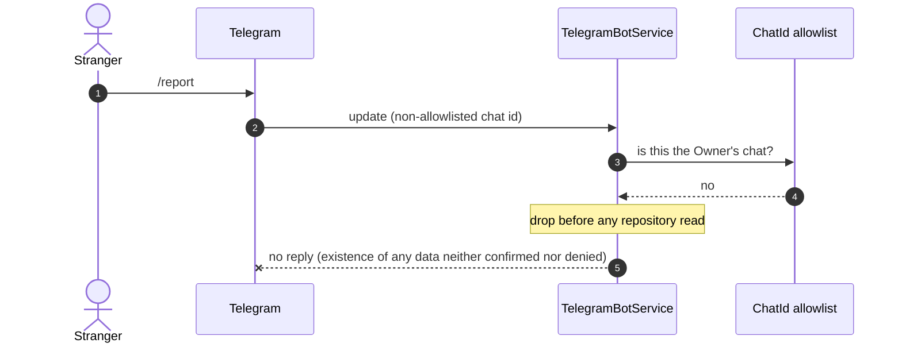

# Sequence — Daily digest (/report)

<!-- Stage 07. Covers happy path + no-completed-Run empty state + non-Owner authorization + multi-message chunking. -->
<!-- Realizes sad.md §6 flow 2 (report read). PRD AC-01, AC-04, AC-05, AC-06, AC-09. -->

## Happy path — Owner requests the report



## Domain invariant — a Run is in progress, an earlier one completed

```mermaid
sequenceDiagram
    autonumber
    actor Owner
    participant Bot as TelegramBotService
    participant RunRepo as Run repository
    participant VRepo as Verdict repository

    Owner->>Bot: /report
    Note over RunRepo: a newer Run is in_progress; an older Run is completed
    Bot->>RunRepo: latest COMPLETED Run
    RunRepo-->>Bot: the older completed Run (never the in-progress one)
    Bot->>VRepo: Verdicts for that completed run id
    VRepo-->>Bot: verdicts from the latest completed Run only
    Bot-->>Owner: digest from the latest completed Run (no partial results)
```

## Multi-message chunking — digest larger than one message



## Empty state — no completed Run yet



## Authorization — a non-Owner chat sends /report


