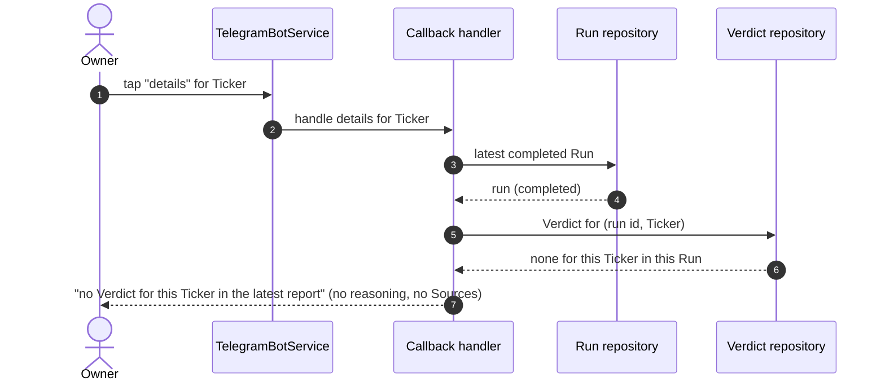
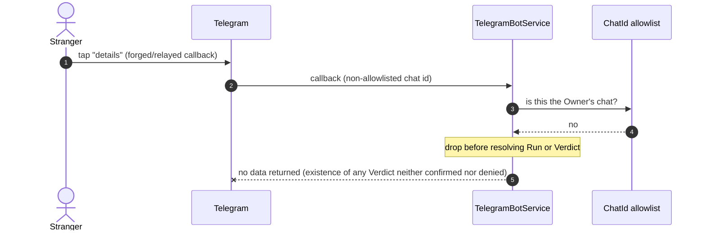

# Sequence — Drill-down (details callback)

<!-- Stage 07. Covers happy path (full reasoning + cited Sources) + Ticker absent from latest Run + non-Owner callback. -->
<!-- Realizes sad.md §6 flow 2 (drill-down). PRD AC-02, AC-02b, AC-05, AC-06. -->

## Happy path — Owner taps "details" for a Ticker

```mermaid
sequenceDiagram
    autonumber
    actor Owner
    participant TG as Telegram
    participant Bot as TelegramBotService
    participant Auth as ChatId allowlist
    participant CB as Callback handler
    participant RunRepo as Run repository
    participant VRepo as Verdict repository
    participant Fmt as Detail formatter

    Owner->>TG: tap "details" for Ticker
    TG->>Bot: callback (chat id + Ticker reference)
    Bot->>Auth: is this the Owner's chat?
    Auth-->>Bot: yes
    Bot->>CB: handle details for Ticker
    CB->>RunRepo: latest completed Run
    RunRepo-->>CB: run (completed)
    CB->>VRepo: Verdict for (run id, Ticker)
    VRepo-->>CB: full reasoning + cited Sources + "what changed"
    CB->>Fmt: render detail (escape reasoning + Source titles)
    Fmt-->>CB: detail message
    CB-->>Bot: message + acknowledge the tap
    Bot->>TG: send detail; acknowledge callback
    TG-->>Owner: full reasoning with cited Sources for that Ticker
```

## Cross-context — requested Ticker has no Verdict in the latest Run



## Authorization — a non-Owner chat sends a details callback


