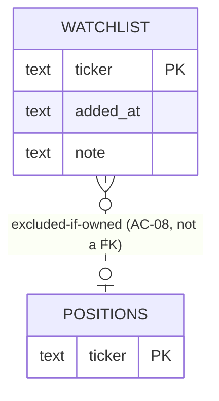

# Data model — watchlist-management

*Datastore note: as of ADR-0007 the store is PostgreSQL (Dapper unchanged). Money columns are `numeric`, identity keys are `BIGINT GENERATED ALWAYS AS IDENTITY`, timestamps remain ISO-8601 text. Column names/semantics below are otherwise unchanged.*

<!-- Stage 08 → owns the `watchlist` table. Persistence per ADR-0003 (SQLite + Dapper).
     Business logic (validation, dedup, size cap) lives in WiseWizard.Core, not in the DB. -->

> **Upstream:** [PRD](../PRD.md) §5 AC · [ADR-0003 SQLite](../../00-overview/adr/0003-sqlite-persistence.md) · [sad.md §5, §8](../../00-overview/sad.md)

This feature owns exactly one table, `watchlist`, in the domain SQLite database. It is read by the nightly-research-pipeline when it builds the Universe (Portfolio Positions ∪ Watchlist Tickers). It never stores owned Positions — those live in the `positions` table owned by the ibkr-portfolio-read feature and are read cross-context only to enforce AC-08.

## ER diagram

The dotted relation is a business rule enforced in `WiseWizard.Core`, not a database foreign key: a Ticker present in `positions` must not be added to `watchlist` (AC-08). The two tables are independent so that a Position leaving the Portfolio never cascades into the Watchlist.

## Entities

### `watchlist`

| Column | Type | Constraints | Notes |
|---|---|---|---|
| `ticker` | TEXT | PRIMARY KEY, NOT NULL | The normalized Ticker symbol. Stored uppercase, trimmed. Serves as the natural, deduplicating key — the PK enforces the "at most once" invariant (AC-07) at the storage layer as a backstop to the domain check. |
| `added_at` | TEXT | NOT NULL | ISO-8601 UTC timestamp of when the Owner added the Ticker (AC-01). Stored as text per SQLite convention. |
| `note` | TEXT | NULL allowed | Optional free-text note authored by the Owner (US-04). Opaque, never interpreted. Length ≤ 280 chars enforced in the domain (PRD NFR §6). |

**Access patterns:**
- List the full Watchlist ordered by `added_at` (AC-02) → primary-key scan; the table is tiny (≤ 100 rows, PRD NFR §6) so no secondary index is needed.
- Look up a single Ticker to check existence on add/remove (AC-03, AC-05, AC-07) → primary-key lookup on `ticker`.
- Read all Tickers to build the Universe (nightly Run) → full-table scan of `ticker`.

**Constraints:** PRIMARY KEY on `ticker` (uniqueness / dedup backstop). No foreign key to `positions` — the owned-Position exclusion (AC-08) is a domain rule, not a referential constraint. `WAL` journal mode is enabled at the database level per ADR-0003 to keep single-process concurrent reads/writes simple.

<!-- Why: business logic (symbol format, casing normalization, size cap, note length, owned-Position exclusion) lives in WiseWizard.Core. The DB carries only PK / NOT NULL. -->

## Domain invariants (enforced in `WiseWizard.Core`, not the DB)

These belong to the domain model / `IWatchlistRepository` collaborators, not to SQLite:

- **Ticker normalization:** a raw symbol is trimmed of surrounding whitespace and uppercased before it is stored or compared. `aapl`, ` AAPL `, and `AAPL` all normalize to `AAPL`, so casing/spacing never creates a duplicate (AC-07).
- **Ticker format:** after normalization a Ticker is 1–10 characters, each of which is a letter, digit, dot (`.`), or hyphen (`-`). Anything else is rejected as malformed (AC-04, PRD NFR §6).
- **No duplicate Ticker:** the domain checks for an existing entry before insert and treats a repeat add as an idempotent no-op with an "already watched" outcome (AC-07); the PRIMARY KEY is the storage-level backstop.
- **Not-owned:** before an add the domain checks the `positions` table (cross-context read, ibkr-portfolio-read); a Ticker that is an owned Position is refused (AC-08).
- **Size cap:** the domain refuses an add that would push the Watchlist above 100 Tickers (PRD NFR §6).
- **Note length:** a note longer than 280 characters is rejected before persistence (PRD NFR §6).

## Model & abstraction (WiseWizard.Core)

- `WatchlistEntry` — domain model: `Ticker` (normalized symbol), `AddedAt` (UTC instant), `Note` (optional).
- `IWatchlistRepository` — abstraction defined in `WiseWizard.Core/Abstractions`, implemented by a Dapper/SQLite repository in `WiseWizard.Infrastructure/Persistence` (sad.md §5):
  - `Task<IReadOnlyList<WatchlistEntry>> GetAllAsync()` — serves AC-02 and the Universe build.
  - `Task<bool> ExistsAsync(string ticker)` — serves AC-03, AC-05, AC-07.
  - `Task AddAsync(WatchlistEntry entry)` — serves AC-01.
  - `Task<bool> RemoveAsync(string ticker)` — serves AC-03/AC-05; returns whether a row was removed.
  - `Task<int> CountAsync()` — serves the size-cap invariant.

## Indexes

| Index | Columns | Query it serves |
|---|---|---|
| (PRIMARY KEY) | `ticker` | existence check on add/remove, dedup backstop, Universe build |

No secondary indexes: the table holds ≤ 100 rows (PRD NFR §6), so the primary-key scan already satisfies every access pattern within the latency targets.
