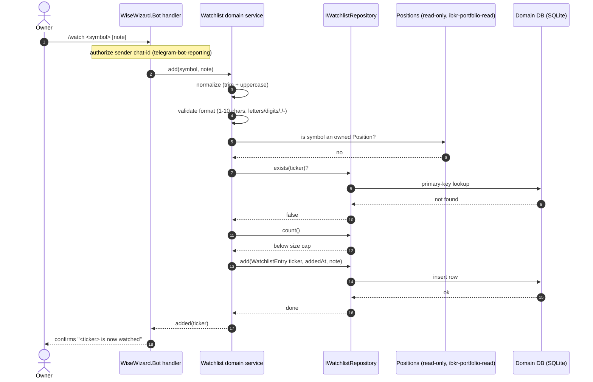

# Sequence — Add a Ticker to the Watchlist

<!-- Stage 07. Covers happy path + error/authz/invariant/cross-context paths.
     The Bot participant (transport) is owned by telegram-bot-reporting; here it is
     the caller into the Watchlist domain. This flow owns everything from the domain
     service inward. -->

> **Upstream:** [PRD](../PRD.md) §5 AC-01, AC-04, AC-06, AC-07, AC-08 · [data-model](../data-model.md) · [sad.md §5, §6](../../00-overview/sad.md)

## Happy path (AC-01)



## Error path: malformed symbol (AC-04)

```mermaid
sequenceDiagram
    autonumber
    actor Owner
    participant Bot as WiseWizard.Bot handler
    participant Svc as Watchlist domain service

    Owner->>Bot: /watch <malformed symbol>
    Bot->>Svc: add(symbol)
    Svc->>Svc: normalize
    Svc->>Svc: validate format -> invalid
    Svc-->>Bot: rejected (malformed symbol)
    Bot-->>Owner: explains the symbol must be a well-formed Ticker; nothing added
```

## Authorization path: sender is not the Owner (AC-06)

```mermaid
sequenceDiagram
    autonumber
    actor Other as Non-Owner
    participant Bot as WiseWizard.Bot handler
    participant Svc as Watchlist domain service

    Other->>Bot: /watch <symbol>
    Note over Bot: sender chat-id not on Owner allowlist
    Bot-->>Other: declines; request never reaches Svc
    Note over Svc: no domain call, no change to the Watchlist
```

## Domain-invariant path: duplicate Ticker (AC-07)

```mermaid
sequenceDiagram
    autonumber
    actor Owner
    participant Bot as WiseWizard.Bot handler
    participant Svc as Watchlist domain service
    participant Repo as IWatchlistRepository
    participant DB as Domain DB (SQLite)

    Owner->>Bot: /watch <symbol already watched>
    Bot->>Svc: add(symbol)
    Svc->>Svc: normalize + validate -> ok
    Svc->>Repo: exists(ticker)?
    Repo->>DB: primary-key lookup
    DB-->>Repo: found
    Repo-->>Svc: true
    Svc-->>Bot: already watched (idempotent no-op)
    Bot-->>Owner: tells the Owner the Ticker is already watched; single entry kept
```

## Cross-context path: symbol already owned (AC-08)

```mermaid
sequenceDiagram
    autonumber
    actor Owner
    participant Bot as WiseWizard.Bot handler
    participant Svc as Watchlist domain service
    participant Pos as Positions (read-only, ibkr-portfolio-read)

    Owner->>Bot: /watch <symbol of an owned Position>
    Bot->>Svc: add(symbol)
    Svc->>Svc: normalize + validate -> ok
    Svc->>Pos: is symbol an owned Position?
    Pos-->>Svc: yes
    Svc-->>Bot: refused (already an owned Position)
    Bot-->>Owner: tells the Owner it is already owned; not added to the Watchlist
```
