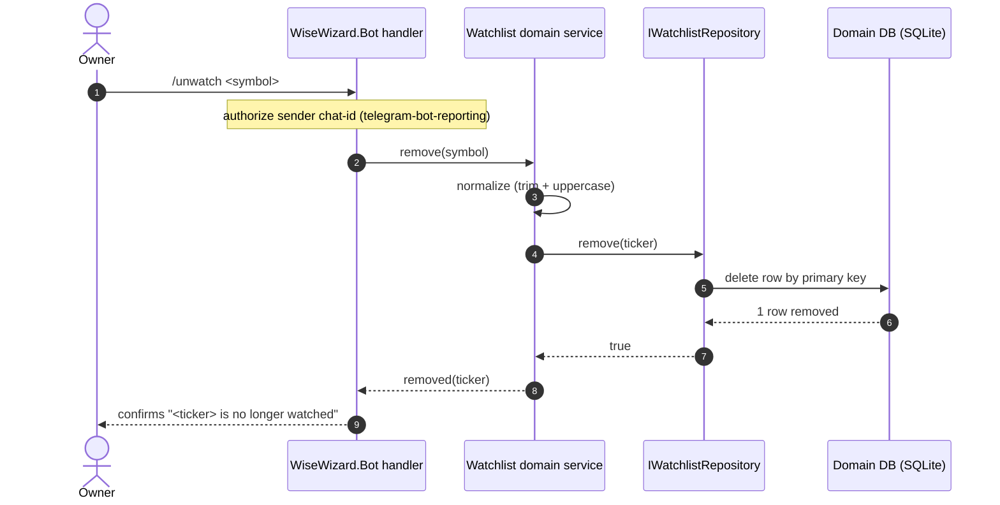
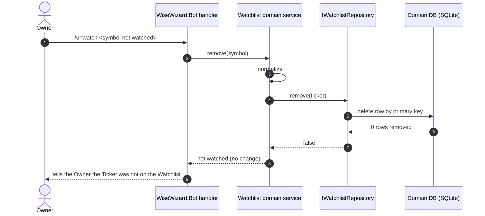

# Sequence — Remove a Ticker from the Watchlist

<!-- Stage 07. Covers happy path + not-watched error + authz path.
     The Bot participant (transport) is owned by telegram-bot-reporting. -->

> **Upstream:** [PRD](../PRD.md) §5 AC-03, AC-05, AC-06 · [data-model](../data-model.md) · [sad.md §5, §6](../../00-overview/sad.md)

## Happy path (AC-03)



## Error path: Ticker not on the Watchlist (AC-05)



## Authorization path: sender is not the Owner (AC-06)

```mermaid
sequenceDiagram
    autonumber
    actor Other as Non-Owner
    participant Bot as WiseWizard.Bot handler
    participant Svc as Watchlist domain service

    Other->>Bot: /unwatch <symbol>
    Note over Bot: sender chat-id not on Owner allowlist
    Bot-->>Other: declines; request never reaches Svc
    Note over Svc: no domain call, no change to the Watchlist
```
