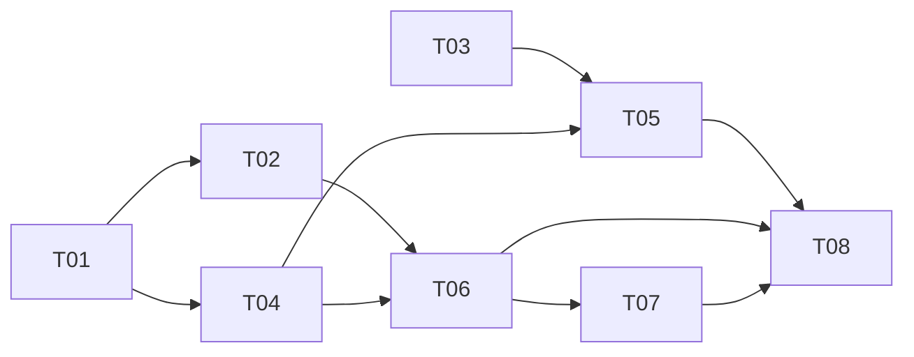

# Task tracker — watchlist-management

→ Epic: [_epic.md](./_epic.md)

## Status

| # | Task | Owner | Est | Deps | Status |
|---|---|---|---|---|---|
| T01 | [WatchlistEntry model](./t01-watchlistentry-model.md) | Owner | S | — | Not started |
| T02 | [Ticker normalization + validation](./t02-ticker-normalization-validation.md) | Owner | S | T01 | Not started |
| T03 | [watchlist table + WAL migration](./t03-watchlist-schema.md) | Owner | S | — | Not started |
| T04 | [IWatchlistRepository abstraction](./t04-iwatchlistrepository-abstraction.md) | Owner | S | T01 | Not started |
| T05 | [Dapper/SQLite repository impl](./t05-dapper-repository-impl.md) | Owner | M | T03, T04 | Not started |
| T06 | [Watchlist domain service](./t06-watchlist-service.md) | Owner | M | T02, T04 | Not started |
| T07 | [Owned-Position exclusion (AC-08)](./t07-owned-position-exclusion.md) | Owner | S | T06 | Not started |
| T08 | [Unit + integration tests](./t08-tests.md) | Owner | M | T05, T06, T07 | Not started |

Estimate legend: S ≈ 2h, M ≈ half-day, L ≈ full day.

## Dependency graph

Parallel branches: T01 and T03 can start together. T02 and T04 fork from T01. T05 (persistence) and T06 (service) run in parallel once their deps land, converging at T08.
